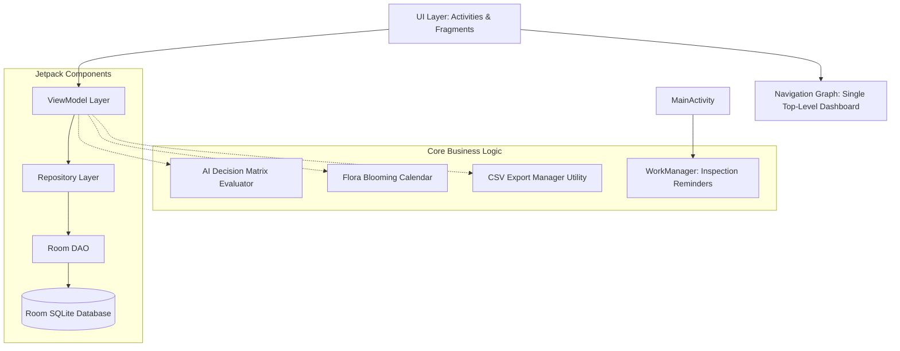

# Madhu Marga (ಮಧು ಮಾರ್ಗ) 🐝

**Madhu Marga** is a premium, offline-first Android beekeeping management application tailored for Indian farmers and rural apiarists. Designed with a simplified, highly accessible user experience, the app tracks hive health, logs structured inspections, suggests AI-driven interventions, monitors honey harvest yields, and provides seasonal floral guidance.

---

## 🎨 UI/UX Design System: "Saffron Silence & Agricultural Warmth"

The application has been fully modernized using the **Stitch AI Design System** to provide a warm, premium, and culturally resonant aesthetic:
* **Color Palette**:
  - **Primary Saffron**: `#D97706` (Represents rich forest honey and traditional warmth).
  - **Background Cream**: `#FDF9E9` (Soft, meditative warm white for high outdoor readability).
  - **Surface Overlay**: `#F2EEDE` (Parchment-toned cards for clear visual hierarchy).
* **Typography**:
  - **Headlines**: `EB Garamond` (Classic serif for a professional, trustworthy feel).
  - **Body & Labels**: `Manrope` / `sans-serif-medium` (Clean, modern readability for dense data).
* **Geometry & Components**:
  - **Premium Cards**: `24dp` rounded corners with subtle elevation for an organic, tactile interface.
  - **Pill Buttons**: Fully rounded `28dp` corner radius (`56dp` height) for accessible, easy-to-tap touch targets.

---

## 📸 Application Screenshots

| Login & Authentication | Main Dashboard | Hive Management |
| :---: | :---: | :---: |
|  |  |  |
| **Inspection Log** | **Harvest Tracker** | **Flora Calendar** |
|  |  |  |

---

## 🌟 Key Features (v1.0 Production Release)

1. **Offline-First Architecture (Room DB)**:
   - Built entirely on Android's Room SQLite database. Farmers in remote rural areas can log inspections, manage hives, and view analytics with **zero internet connectivity**.
2. **AI Decision Matrix**:
   - Automated rule-based expert logic evaluates inspection observations (queen presence, pest activity, temperature) to provide instant, color-coded actionable interventions (e.g., Emergency Re-queening, Mite Treatment, Harvest Alerts).
3. **Harvest Tracker & Analytics**:
   - Log honey yields (kg) by season and hive.
   - Beautiful interactive bar chart visualizations powered by **MPAndroidChart** displaying annual yield trends.
4. **Flora Blooming Calendar**:
   - Built-in static seasonal guide assisting beekeepers in tracking local floral nectar and pollen flow across India.
5. **Automated Background Reminders (WorkManager)**:
   - Background periodic workers verify inspection histories and trigger local system notifications for overdue hive evaluations (14-day cycle).
6. **Data Export Utility**:
   - One-tap CSV export utility backing up all hive, inspection, and harvest records directly to the device's Downloads directory for easy sharing with agricultural extension officers.
7. **Hybrid Security & Authentication**:
   - Supports robust local Room DB credential management with mathematical password hashing.
   - Fully integrated with **Firebase BoM (v34.13.0)**, Firebase Auth, and Analytics for optional cloud-based management.

---

## 🛠️ Comprehensive Setup & Run Instructions

Follow these exact steps to build, run, and evaluate the project for final submission:

### 1. Prerequisites & Environment
* **Android Studio**: Version **Iguana (2023.2.1)** or newer recommended.
* **Java Development Kit (JDK)**: **JDK 17** (Verify in Android Studio under `Settings > Build, Execution, Deployment > Build Tools > Gradle`).
* **Android SDK**: API Level **24 (Android 7.0)** minimum; API **34** target.

### 2. Project Import & Gradle Sync
1. Open **Android Studio** and select **File > Open...**.
2. Select the `Madhu Marga` root folder.
3. Allow Gradle to perform the initial project sync. 
   *(Note: The project is strictly configured with **AGP 8.6.0**, **Kotlin 2.3.21**, and **KSP 2.3.7** to prevent any metadata or dependency conflicts).*

### 3. Firebase Configuration (Pre-Configured for Evaluation)
> [!NOTE]
> **For Evaluators & Reviewers:** A fully functional, pre-configured `app/google-services.json` file is **already included** in this repository. You can build, run, and test the entire application (including Firebase Auth and Storage) immediately without any additional cloud setup.

#### 🔑 Evaluation Login Credentials
To evaluate the application immediately without filling out the registration form, you can use the following pre-configured test credentials on the Login screen:
* **Email**: 'admin@gmail.com'
* **Password**: `Admin123`

*(Alternatively, reviewers can click the **Register** button on the launch screen to create a new account with any valid email and password of their choice).*

**For Developers Deploying Their Own Cloud Instance (Optional):**
If you wish to connect the application to your own Firebase backend:
1. Go to the [Firebase Console](https://console.firebase.google.com/).
2. Create a new project and register the Android app with package name `com.madhum.marga`.
3. Download your new `google-services.json` file and place it inside the `app/` directory, overwriting the included evaluation file.

### 4. Building & Running the Application
* **Via Android Studio GUI**:
  1. Connect a physical Android device (USB Debugging enabled) or start an Android Emulator (API 30+).
  2. Select `app` from the run configurations dropdown.
  3. Click the green **Run** (Play) button.
* **Via Command Line (Terminal/PowerShell)**:
  To generate a clean debug APK directly from the terminal without IDE file locks:
  ```powershell
  .\gradlew --stop
  .\gradlew assembleDebug --no-daemon
  ```
  The compiled APK will be available at: `app\build\outputs\apk\debug\app-debug.apk`.

---

## ⚠️ Troubleshooting & Common Fixes

* **Windows File Lock Errors (`mergeDebugResources`)**:
  If Android Studio is open while running CLI builds, Windows may lock resource cache files. 
  *Fix*: In Android Studio, click **Build > Clean Project**, or go to **File > Invalidate Caches... > Invalidate and Restart**.
* **Database Migration Errors**:
  If you modify any Room Entity (`Hive.kt`, `HarvestLog.kt`), you must increment `DATABASE_VERSION` inside `MadhuDatabase.kt` or clear the app storage on your testing device.
* **Testing Background Reminders**:
  To manually trigger the WorkManager inspection reminder without waiting 24 hours, run the following ADB command in your terminal:
  ```bash
  adb shell cmd jobmgr run -f com.madhum.marga 0
  ```

---

## 🏗️ System Architecture & Data Flow



---

## 📊 AI Decision Matrix Ruleset

When an inspection is logged, the AI Decision Matrix evaluates the parameters against the following expert ruleset:

| Observed Conditions | Suggested Intervention | Alert Priority |
| :--- | :--- | :--- |
| **Low Activity** | Inspect for queen loss or disease—check for eggs and brood patterns. | ⚠️ High |
| **No Queen + Low Activity** | EMERGENCY: Re-queen this colony or merge with a stronger hive within 7 days. | 🚨 Critical |
| **Mites/Pests Observed** | Apply varroa treatment. Recheck hive in 7 days. Document results. | ⚠️ High |
| **High Temp + Clustering** | Improve ventilation. Add shade cover or move hive to cooler location. | ℹ️ Tip |
| **High Honey + Full Frames**| ✅ Ready to Harvest: Add supers or extract honey now to prevent swarming. | ✅ Action |
| **Medium/High Activity + Queen** | Hive is healthy. Continue routine inspections every 10–14 days. | ℹ️ Tip |

---

## 📦 Final Submission Deliverables
* **Source Code**: Fully commented, modular Kotlin codebase following clean architecture.
* **Production APK**: Located in `app/build/outputs/apk/debug/app-debug.apk`.
* **Icons & Assets**: Custom high-fidelity Saffron bee branding (`ic_bee_logo`).
* **Documentation**: Complete setup, architecture, and testing guidelines included in this `README.md`.
